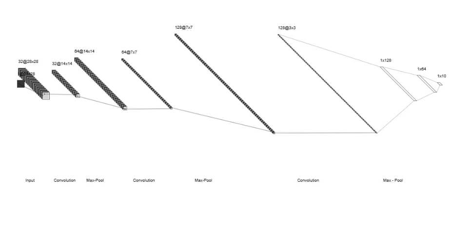
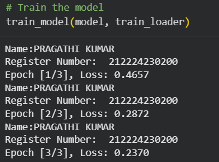
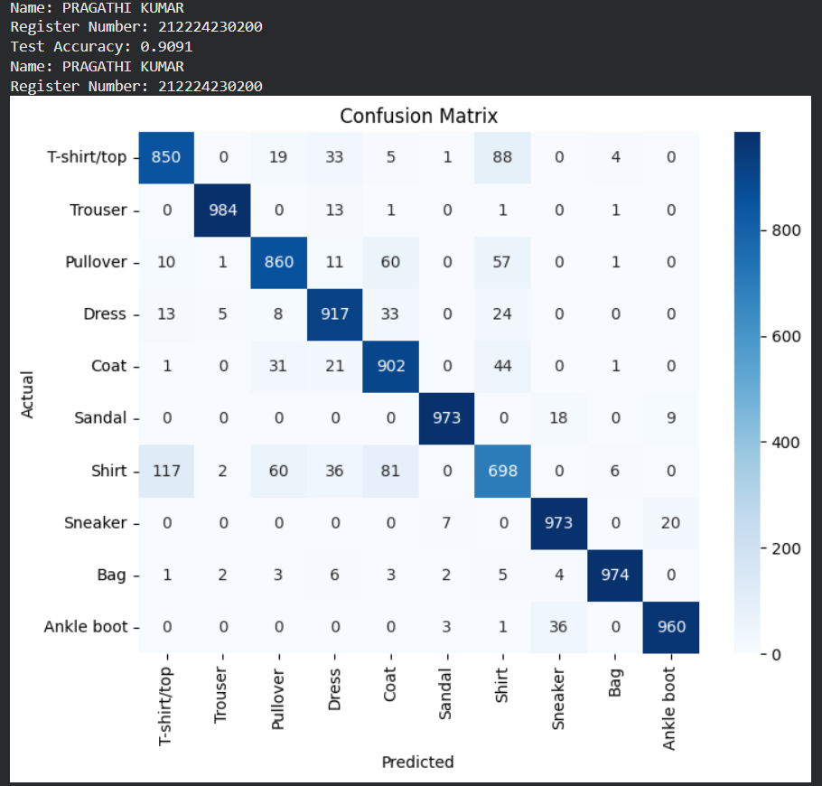
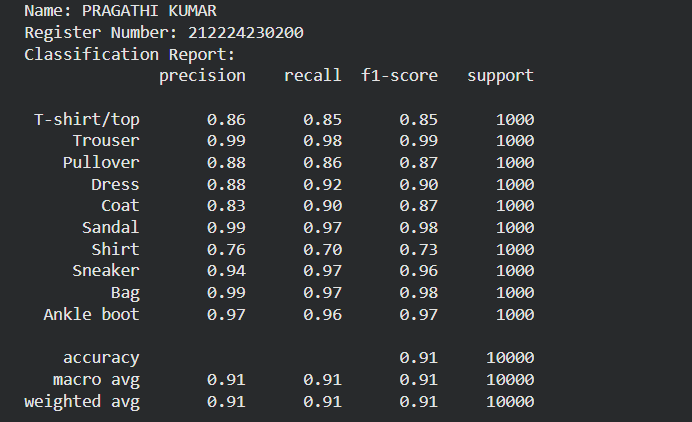
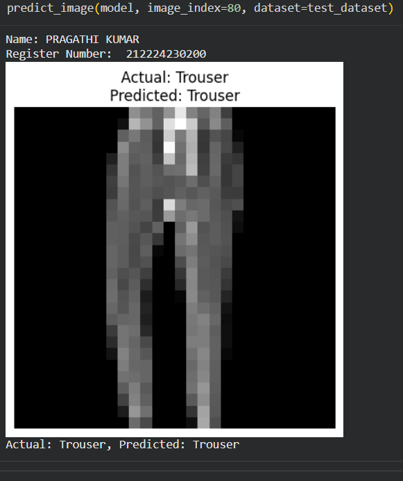

# Convolutional Deep Neural Network for Image Classification

## AIM

To Develop a convolutional deep neural network for image classification and to verify the response for new images.

## Problem Statement and Dataset

The objective of this project is to create a CNN that can categorize images of fashion items from the Fashion MNIST dataset. This dataset includes grayscale images of clothing and accessories such as T-shirts, trousers, dresses, and footwear. The task is to accurately predict the correct category for each image while ensuring the model is efficient and robust.

1.Training data: 60,000 images

2.Test data: 10,000 images

3.Classes: 10 fashion categories

The CNN consists of multiple convolutional layers with activation functions, followed by pooling layers, and ends with fully connected layers to output predictions for all 10 categories.

## Neural Network Model




## DESIGN STEPS

### STEP 1:

Import the necessary libraries such as NumPy, Matplotlib, and PyTorch.

### STEP 2:

Load and preprocess the dataset:

Resize images to a fixed size (128×128). Normalize pixel values to a range between 0 and 1. Convert labels into numerical format if necessary.

### STEP 3:

Define the CNN Architecture, which includes:

Input Layer: Shape (8,128,128) Convolutional Layer 1: 8 filters, kernel size (16×16), ReLU activation Max-Pooling Layer 1: Pool size (2×2) Convolutional Layer 2: 24 filters, kernel size (8×8), ReLU activation Max-Pooling Layer 2: Pool size (2×2) Fully Connected (Dense) Layer: First Dense Layer with 256 neurons Second Dense Layer with 128 neurons Output Layer for classification

### STEP 4:

Define the loss function (e.g., Cross-Entropy Loss for classification) and optimizer (e.g., Adam or SGD).

### STEP 5:
Train the model by passing training data through the network, calculating the loss, and updating the weights using backpropagation.


### STEP 6:
Evaluate the trained model on the test dataset using accuracy, confusion matrix, and other performance metrics.


### STEP 7:

Make predictions on new images and analyze the results.

## PROGRAM

### NAME: PRAGATHI KUMAR

### REGISTER NUMBER: 212224230200

```
class CNNClassifier(nn.Module):
    def __init__(self):
        super(CNNClassifier, self).__init__()
        self.conv1 = nn.Conv2d(in_channels=1,out_channels=32,kernel_size=3, padding=1)
        self.conv2 = nn.Conv2d(in_channels=32,out_channels=64,kernel_size=3, padding=1)
        self.conv3 = nn.Conv2d(in_channels=64,out_channels=128,kernel_size=3,padding=1)
        self.pool = nn.MaxPool2d(kernel_size=2, stride=2)
        self.fc1=nn.Linear(128*3*3,128)
        self.fc2=nn.Linear(128,64)
        self.fc3=nn.Linear(64,10)


    def forward(self, x):
        x=self.pool(torch.relu(self.conv1(x)))
        x=self.pool(torch.relu(self.conv2(x)))
        x=self.pool(torch.relu(self.conv3(x)))
        x=x.view(x.size(0),-1)
        x=torch.relu(self.fc1(x))
        x=torch.relu(self.fc2(x))
        x=self.fc3(x)
        return x


```

```
# Initialize model, loss function, and optimizer
model =CNNClassifier()
criterion =nn.CrossEntropyLoss()
optimizer =optim.Adam(model.parameters(), lr=0.001)


```

```
## Step 3: Train the Model
def train_model(model, train_loader, num_epochs=3):
    for epoch in range(num_epochs):
        model.train()
        running_loss = 0.0
        for images, labels in train_loader:
          optimizer.zero_grad()
          outputs = model(images)
          loss = criterion(outputs, labels)
          loss.backward()
          optimizer.step()
          running_loss += loss.item()


        print('Name:PRAGATHI KUMAR')
        print('Register Number:  212224230200    ')
        print(f'Epoch [{epoch+1}/{num_epochs}], Loss: {running_loss/len(train_loader):.4f}')


```


## OUTPUT
### Training Loss per Epoch




### Confusion Matrix




### Classification Report




### New Sample Data Prediction





## RESULT
Thus, a convolutional neural network for image classification was successfully implemented and verified using an Excel-based dataset
